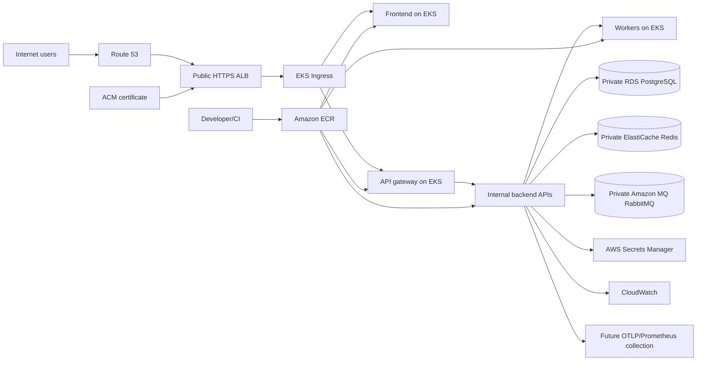

# AWS production architecture

RoundReady production targets AWS. This document defines boundaries and Terraform ownership;
it does not provision an AWS environment.

## Boundaries

Route 53 resolves environment-specific public names to the ALB, and ACM supplies certificates
for HTTPS. The ALB is the only public application ingress. The frontend communicates only with
the API gateway; backend Kubernetes Services, workers, and service-to-service traffic remain
internal. EKS workloads use private networking to reach RDS, ElastiCache, Amazon MQ, and Secrets
Manager through approved network paths and least-privilege IAM.

Amazon MQ for RabbitMQ is the production broker choice. RabbitMQ is not intended to run inside
EKS because broker durability and lifecycle are better managed outside the application cluster.
RDS is authoritative persistence; the seven service-owned databases remain logically isolated
with separate credentials and no cross-service database access.

ElastiCache provides one private Valkey-compatible, non-sharded replication group per environment
for booking locks, rate limiting, and bounded ephemeral coordination. TLS, AUTH, and encryption at
rest are always enabled. Production uses Multi-AZ automatic failover with a replica; Redis remains
non-authoritative and loss/rebuild behavior must never replace PostgreSQL state.

Amazon MQ provides one private RabbitMQ broker per environment. Applications connect only through
AMQPS and retain ownership of exchanges, durable queues, routing keys, retries, and dead-letter
topology. Development uses a single broker to control cost; production uses a three-node
`CLUSTER_MULTI_AZ` deployment. The broker management interface is not publicly accessible.

Developer or CI builds push immutable image versions to ECR, and EKS deploys those versions.
Use `<registry>/<service>:<release-version-or-commit-sha>` or a digest; never use `latest` for
production. CloudWatch receives platform/application logs and metrics, while the existing
OpenTelemetry and Prometheus-compatible application instrumentation can feed future collection
infrastructure.

Terraform creates nine environment-isolated private ECR repositories: frontend, API gateway, and
one for each backend service. Worker commands reuse their owning service image. Repositories use
immutable tags, encryption, scan on push, and rollback-aware lifecycle retention; no public or
cross-account repository policy is installed. Future CI owns authenticated pushes and promotion.

The AWS observability baseline currently consists of one bounded-retention application CloudWatch
log group and, in production, reliable native RDS CPU/free-storage alarms connected to an
unsubscribed SNS topic. Kubernetes log shipping, Prometheus scraping, Grafana, Container Insights,
OTLP collection, and paging subscriptions remain deployment work. Existing application
instrumentation is not duplicated and `/metrics` is never public.

## Security principles

- RDS, Redis, and RabbitMQ are private and not publicly accessible.
- Only the ALB accepts public application traffic; SSH is not required for operation.
- TLS is used for external traffic and managed data services use encryption at rest and in transit.
- Secrets are read from Secrets Manager at runtime and are not placed in Terraform variables,
  outputs, tags, image layers, or logs when avoidable.
- EKS workload IAM follows least privilege and is scoped to the environment and resource.
- Production resources use backups and recovery settings where the managed service supports them.

## Environment and state

Dev, staging, and production have separate Terraform state keys and environment inputs for
region, naming prefix, tags, and future capacity sizing. Account IDs are discovered from AWS
provider credentials; no account ID is hardcoded. Production must set its AWS region explicitly.

The state S3 bucket must be bootstrapped separately with versioning, encryption, restricted IAM,
and the current supported state-locking approach before `terraform init`. Bucket names, account
IDs, and lock configuration are deployment inputs, not committed values.

## Cost awareness

Start conservatively, then scale from measured traffic. Major cost drivers are EKS control-plane
and worker capacity, NAT gateways, RDS, Amazon MQ, ElastiCache, ALB, and CloudWatch ingestion/
retention. Use environment-specific sizing and retention, but do not remove private networking,
backups, encryption, or required availability solely to reduce early cost. Cost allocation tags
are limited to non-sensitive project, environment, and operational ownership values.

For ElastiCache, node type, replicas, Multi-AZ traffic, snapshots, and data transfer drive cost.
For Amazon MQ, broker class and deployment mode dominate, followed by storage, logs, and transfer.
Managed services cost more than single in-cluster processes but remove broker/cache patching,
failover, persistent lifecycle, and operational coupling from EKS.

## VPC networking foundation

Each environment receives a separate VPC with at least two discovered Availability Zones. Public
subnets host the future ALB and NAT gateways. Private application subnets are intended for EKS
workloads and use NAT for controlled outbound access. Private data subnets are reserved for RDS,
ElastiCache, and Amazon MQ and receive no default Internet route. Data services therefore never
require public IPs or public subnets.

Production uses one NAT Gateway per AZ for resilience; development and staging may use one
shared NAT Gateway to reduce cost and accept an AZ failure tradeoff. VPC Flow Logs are enabled
for production to a minimal CloudWatch destination and disabled by default for cost-sensitive
environments. Default stateful network ACLs remain in use; service-specific security groups
belong to the EKS, RDS, Redis, Amazon MQ, and ALB modules rather than the VPC module.

Future private VPC endpoints may cover ECR API/DKR, S3, Secrets Manager, CloudWatch Logs, and
STS. They are deferred until workload traffic and endpoint costs justify them.

## EKS foundation

EKS runs the frontend, API gateway, backend APIs, and dedicated workers as separate
workloads. The control plane and managed on-demand node group use the VPC's private application
subnets across at least two discovered AZs; nodes never use public or private data subnets. The
controller-created ALB is the only public application ingress. Kubernetes Services remain internal
unless an explicit later boundary requires exposure.

The cluster uses a pinned Kubernetes version, private API endpoint access, optional explicitly
restricted public administrator access, configurable control-plane logs, and KMS encryption for
Kubernetes Secrets. Cluster and node IAM roles use only required AWS-managed policies. EKS Pod
Identity supplies service-specific roles and associations scoped to exact owned
Secrets Manager ARNs and matching Kubernetes ServiceAccounts. EKS access entries
are prepared for explicitly configured operator principals without hardcoded
personal mappings.

EKS control-plane charge, on-demand worker nodes, EBS node disks, control-plane log ingestion,
and NAT traffic are major early cost drivers. Development can reduce node/log/NAT capacity;
production retains multi-AZ nodes and private networking. Autoscaling remains a
later implementation step.

## Public HTTPS ingress prerequisites

Terraform and Kubernetes have deliberately separate ownership. Terraform looks up an existing
public Route 53 hosted zone, provisions the regional ACM certificate and DNS validation records,
and creates the Pod Identity-compatible IAM role/policy for AWS Load Balancer Controller v2.14.1.
It does not create an ALB, listener, target group, Kubernetes ServiceAccount, controller
installation, or Ingress. Terraform creates the controller Pod Identity association for the fixed
`kube-system/aws-load-balancer-controller` identity.

A later Kubernetes deployment installs the Pod Identity Agent and AWS Load Balancer Controller,
creates the matching `kube-system` ServiceAccount, and applies one public
Ingress. The controller then owns the ALB lifecycle. The ALB uses tagged public subnets while
frontend and API gateway targets remain on private application subnets. Individual backend
microservices, workers, databases, Redis, and RabbitMQ never receive public hostnames or ingress.

The intended routing uses two explicitly configured hostnames: one frontend hostname and one API
gateway hostname. The frontend calls only the API gateway. ACM uses DNS validation in the same AWS
region as the future ALB. Route 53 alias records are deferred until the controller-created ALB DNS
name and canonical zone ID exist; no placeholder or broken alias is created.

Production listener behavior is HTTPS 443 with a current modern AWS TLS security policy. Port 80,
if enabled later, performs redirect-only HTTP to HTTPS. Do not expose NodePorts or backend ports to
the Internet or add public ingress to the EKS node security boundary. The controller manages ALB
and target security-group rules; those rules must allow only the required ALB-to-target path.

Use `/ready` for ALB target health so dependency-unavailable pods stop receiving traffic while
`/health` remains the liveness probe. Set gateway `CORS_ORIGINS` to the exact HTTPS frontend origin
and set frontend `NEXT_PUBLIC_API_BASE_URL` to the HTTPS API hostname. Wildcard production CORS and
plaintext production API URLs remain prohibited.

An optional future AWS WAF association may add managed common, known-bad-input, IP reputation, and
rate-based rules. It is not created here and does not replace the application's Redis-backed auth
rate limiting. A shared ingress minimizes ALB hourly and LCU costs; Route 53 hosted-zone/query and
optional WAF charges also apply. ACM public certificates used with integrated AWS services do not
require private certificate material or per-microservice certificates.
