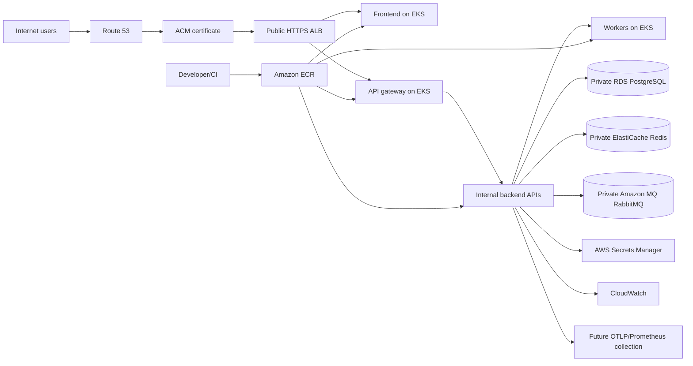

# AWS production architecture

RoundReady production targets AWS. This document defines boundaries and Terraform ownership;
it does not provision an AWS environment.

## Boundaries

Route 53 resolves environment-specific public names to the ALB, and ACM supplies certificates
for HTTPS. The ALB is the only public application ingress. The frontend communicates only with
the API gateway; backend Kubernetes Services, workers, and service-to-service traffic remain
internal. EKS workloads use private networking to reach RDS, ElastiCache, Amazon MQ, and Secrets
Manager through approved network paths and least-privilege IAM.

Amazon MQ for RabbitMQ is the production broker choice. RabbitMQ is not intended to run inside
EKS because broker durability and lifecycle are better managed outside the application cluster.
RDS is authoritative persistence; the seven service-owned databases remain logically isolated
with separate credentials and no cross-service database access.

Developer or CI builds push immutable image versions to ECR, and EKS deploys those versions.
Use `<registry>/<service>:<release-version-or-commit-sha>` or a digest; never use `latest` for
production. CloudWatch receives platform/application logs and metrics, while the existing
OpenTelemetry and Prometheus-compatible application instrumentation can feed future collection
infrastructure.

## Security principles

- RDS, Redis, and RabbitMQ are private and not publicly accessible.
- Only the ALB accepts public application traffic; SSH is not required for operation.
- TLS is used for external traffic and managed data services use encryption at rest and in transit.
- Secrets are read from Secrets Manager at runtime and are not placed in Terraform variables,
  outputs, tags, image layers, or logs when avoidable.
- EKS workload IAM follows least privilege and is scoped to the environment and resource.
- Production resources use backups and recovery settings where the managed service supports them.

## Environment and state

Dev, staging, and production have separate Terraform state keys and environment inputs for
region, naming prefix, tags, and future capacity sizing. Account IDs are discovered from AWS
provider credentials; no account ID is hardcoded. Production must set its AWS region explicitly.

The state S3 bucket must be bootstrapped separately with versioning, encryption, restricted IAM,
and the current supported state-locking approach before `terraform init`. Bucket names, account
IDs, and lock configuration are deployment inputs, not committed values.

## Cost awareness

Start conservatively, then scale from measured traffic. Major cost drivers are EKS control-plane
and worker capacity, NAT gateways, RDS, Amazon MQ, ElastiCache, ALB, and CloudWatch ingestion/
retention. Use environment-specific sizing and retention, but do not remove private networking,
backups, encryption, or required availability solely to reduce early cost. Cost allocation tags
are limited to non-sensitive project, environment, and operational ownership values.

## VPC networking foundation

Each environment receives a separate VPC with at least two discovered Availability Zones. Public
subnets host the future ALB and NAT gateways. Private application subnets are intended for EKS
workloads and use NAT for controlled outbound access. Private data subnets are reserved for RDS,
ElastiCache, and Amazon MQ and receive no default Internet route. Data services therefore never
require public IPs or public subnets.

Production uses one NAT Gateway per AZ for resilience; development and staging may use one
shared NAT Gateway to reduce cost and accept an AZ failure tradeoff. VPC Flow Logs are enabled
for production to a minimal CloudWatch destination and disabled by default for cost-sensitive
environments. Default stateful network ACLs remain in use; service-specific security groups
belong to the EKS, RDS, Redis, Amazon MQ, and ALB modules rather than the VPC module.

Future private VPC endpoints may cover ECR API/DKR, S3, Secrets Manager, CloudWatch Logs, and
STS. They are deferred until workload traffic and endpoint costs justify them.

## EKS foundation

EKS runs the frontend, API gateway, backend APIs, and dedicated workers as separate future
workloads. The control plane and managed on-demand node group use the VPC's private application
subnets across at least two discovered AZs; nodes never use public or private data subnets. The
future ALB will be the only public application ingress. Kubernetes Services remain internal
unless an explicit later boundary requires exposure.

The cluster uses a pinned Kubernetes version, private API endpoint access, optional explicitly
restricted public administrator access, configurable control-plane logs, and KMS encryption for
Kubernetes Secrets. Cluster and node IAM roles use only required AWS-managed policies. EKS Pod
Identity is the preferred future workload IAM mechanism; application roles and associations are
deferred until workload manifests are designed. EKS access entries are prepared for explicitly
configured operator principals without hardcoded personal mappings.

EKS control-plane charge, on-demand worker nodes, EBS node disks, control-plane log ingestion,
and NAT traffic are major early cost drivers. Development can reduce node/log/NAT capacity;
production retains multi-AZ nodes and private networking. Autoscaling add-ons, ALB integration,
and all Kubernetes workloads are later implementation steps.
